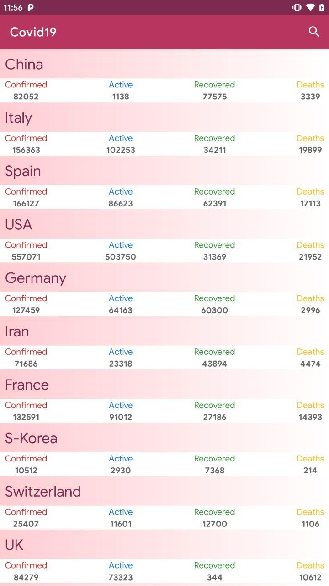
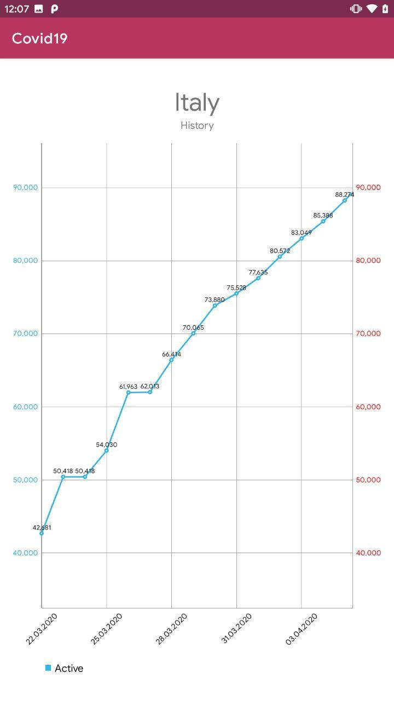

  

# Covid19

**Covid19** is a sample Android app to practice using *Android development* tools.

<table style="width:100%">
  <tr>
    <th>List screen with statistics</th>
    <th>Detail Screen with current data</th>
    <th>Pie chart with current data</th>
    <th>Line chart with history value</th>
    <th>Search by country name</th>
  </tr>
  <tr>
    <td></td>
    <td></td>
    <td></td>
    <td></td>
    <td></td>
  </tr>
</table>

## Built with
- Kotlin - Official programming language for Android development.
- Coroutines - For asynchronous and more..
- Android Architecture Components - Collection of libraries that help you design robust, testable, and maintainable apps.
  - LiveData - Data objects that notify views when the underlying database changes.
  - ViewModel - Stores UI-related data that isn't destroyed on UI changes.
- Retrofit - A type-safe HTTP client for Android and Java.
- Material Components for Android - Modular and customizable Material Design UI components for Android.
- MPAndroidChart - The library for charts.
- MotionLayout - A layout type that helps you manage motion and widget animation in your app.

## Credits
Thanks to [covid19-api](https://covid19-api.com) for open-source API.